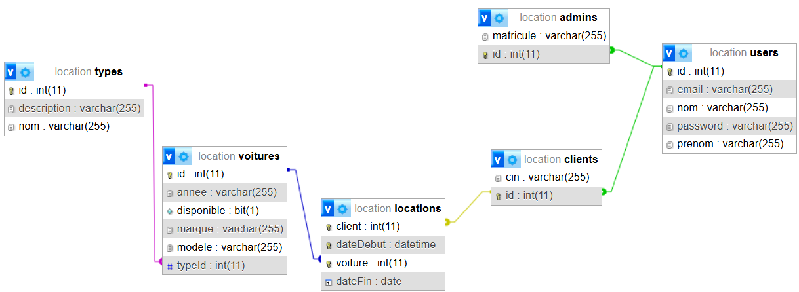
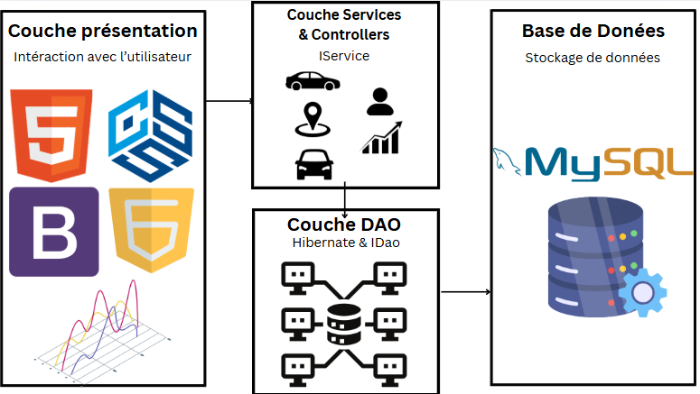

# **Projet : Gestion des Locations de Voitures** 🚙

## 📌 Table des matières
- [Contexte](#contexte)
- [Problématique](#problématique)
- [Objectifs](#objectifs)
- [Technologies Utilisées](#technologies-utilisées)
- [Logo](#logo)
- [Diagramme de classe](#diagramme-de-classe)
- [Modèle conceptuel de la base de donnée](#modèle-conceptuel-de-la-base-de-donnée)
- [Architecture](#architecture)
- [Exécution des tests](#exécution-des-tests)
---

## **Contexte** 🌐

Le secteur de la location de voitures connaît une demande croissante avec l’augmentation de la mobilité et des besoins flexibles de transport. Que ce soit pour un déplacement professionnel, un voyage personnel ou une simple excursion, la location de voiture devient une solution incontournable. Cependant, la gestion de cette activité, notamment la gestion des réservations, de la disponibilité des véhicules et des statistiques, est souvent un défi pour les entreprises de location.

Dans ce cadre, ce projet vise à simplifier et moderniser le processus de location de voitures en offrant une plateforme numérique intuitive, permettant à la fois aux clients de réserver un véhicule en temps réel et aux administrateurs de gérer efficacement leur flotte et leurs statistiques de location.

---

## **Problématique** ❗️

La gestion traditionnelle des locations de voitures présente plusieurs défis importants :

- 📉 **Disponibilité des véhicules** : Les clients ne peuvent pas toujours savoir si une voiture est disponible au moment où ils souhaitent réserver, ce qui peut entraîner des réservations erronées ou des désagréments.

- 🧾 **Complexité dans le suivi des réservations** : Les entreprises ont du mal à suivre efficacement les réservations, notamment avec des systèmes manuels ou fragmentés, ce qui rend le processus long et sujet à des erreurs.

- 📈 **Absence de suivi des tendances** : Les entreprises de location manquent souvent d'outils permettant de visualiser les tendances des types de véhicules les plus demandés, ce qui complique la gestion et l'optimisation de la flotte.

---

## **Objectifs** 🎯

Le but de ce projet est de créer une solution complète et intégrée pour la gestion des locations de voitures, en visant à atteindre les objectifs suivants :

1. 🧑‍💻 **Offrir une interface utilisateur claire et fluide**  
   Permettre aux utilisateurs de facilement consulter les voitures disponibles à la location, de réserver en quelques clics et de suivre l’historique de leurs locations.

2. 🔁 **Implémenter un système de vérification instantanée de la disponibilité des véhicules avec AJAX**  
   Grâce à AJAX, les utilisateurs pourront vérifier en temps réel si une voiture est disponible pour la période souhaitée, offrant ainsi une expérience sans attente.

3. 📊 **Fournir des statistiques dynamiques sur les locations**  
   Grâce à `Chart.js`, les administrateurs pourront consulter des graphiques interactifs montrant les locations par type de voiture, facilitant ainsi la prise de décision pour l'optimisation de la flotte et des prix.

4. 🗂 **Gérer efficacement les utilisateurs et les réservations**  
   Mettre en place un système robuste pour les administrateurs permettant de gérer les voitures, les utilisateurs et les historiques de location de manière simple et centralisée.

5. 🚘 **Optimiser la gestion de la flotte**  
   Offrir aux administrateurs des outils pour suivre les réservations, les retours de voitures et ajuster les stocks en fonction des demandes et des saisons.

---

## **Technologies Utilisées** 🛠

- 💻 **Java Web**
- 🗃 **Base de données** : MySQL
- 📈 **Chart.js** pour les graphiques statistiques
- ⚡ **AJAX** pour la gestion en temps réel de la disponibilité des voitures

---
## **Logo** 🧩

---

## **Diagramme de classe** 🧩

---

## **Modèle conceptuel de la base de donnée** 🧠

---

## **Architecture** 🧩

---

## **Vidéo démonstrative** 
https://github.com/user-attachments/assets/4b28919f-b81b-426d-a122-c7118a093b99
